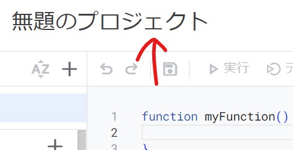

# translate_api
翻訳機能をapiを使って実装します。  
以下にGoogle翻訳APIの利用方法を記載しておきます。  
<br>
<br>
## Google Apps Script(GAS)
### 1.ログイン
Googleアカウントを利用して、以下のサイトにアクセスしてください。  
https://script.google.com/home  

### 2.プロジェクトの作成
新しいプロジェクトを作成をクリック  


### 3.名前の変更
プロジェクト名とファイル名を変えてください。  



### 4.実装
下のコードを丸ごとコピペしてください。
```javascript
function doGet(e) {
  var p = e.parameter;
  var translatedText = LanguageApp.translate(p.text, p.source, p.target);
  return ContentService.createTextOutput(translatedText);
}
```

### 5.デプロイ
プロジェクトを公開します。  
新しいデプロイを選択、  
  
種類はウェブアプリ  
  
  
設定は上から、  
説明文は何でもOK  
次のユーザーとして実行は自分を選択  
アクセスできるユーザーは全員  
を選択してください。  
  
<br>
下のURLを使用することになります。 
分かりやすい場所に取っておきましょう。  
 
こちらにクエリを追加して、言語とテキストを設定します。
クエリは以下のように設定します。  
```
https://script.google.com/～～/exec?text=この部分を翻訳します&source=ja&target=en
```
?以降がクエリ部分となっており、GAS上ではpに代入しており、p.textのように呼び出します。  
GASで動作を増やしたい場合はクエリを個別に追加してください。  